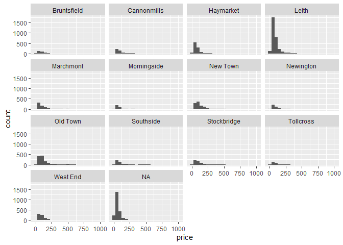

HW 01 - Airbnb listings in Edinburgh
================
Sara Bond
July 13th, 2022

## Load packages and data

``` r
library(tidyverse)
library(dsbox)
```

## Exercises

### Exercise 1

There are 13245 rows in the data set.

### Exercise 2

Each row represents an airbnb.

### Exercise 3

The wrap function made everything easier to read and less cramped given
the amount of neighborhoods.

``` r
ggplot(data = edibnb, mapping = aes(x = price)) +
  geom_histogram(binwidth = 50) +
  facet_wrap(~neighbourhood)
```

    ## Warning: Removed 199 rows containing non-finite values (stat_bin).

<!-- -->

### Exercise 4

Remove this text, and add your answer for Exercise 4 here.

``` r
# remove this comment and add the code for Exercise 4 here
```

``` r
# remove this comment and add the code for Exercise 4 here
```

``` r
# remove this comment and add the code for Exercise 4 here
```

### Exercise 5

Remove this text, and add your answer for Exercise 5 here.

``` r
# remove this comment and add the code for Exercise 5 here
```
